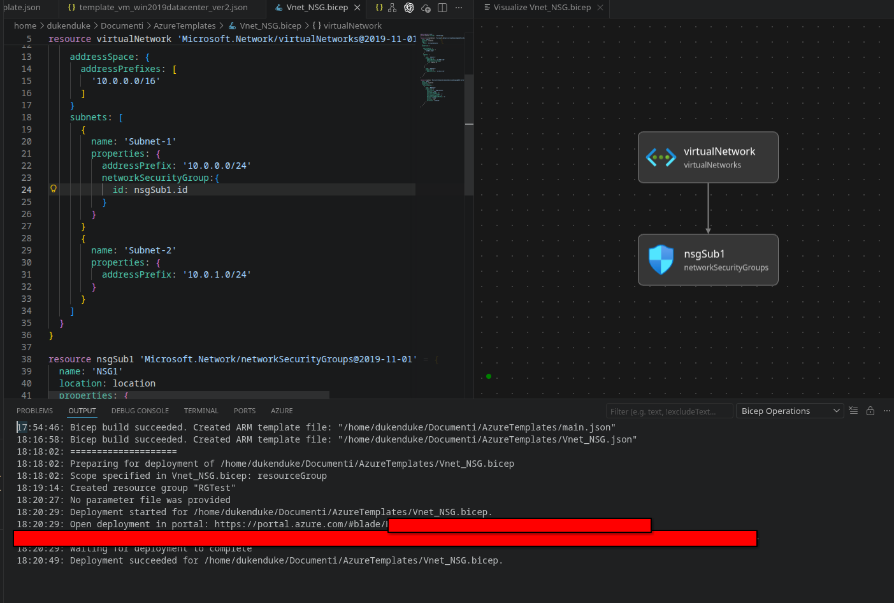

###Deploy VNET + 2 Subnet ed 1 NSG connesso alla Subnet1 mediante Bicep

##Nella sezione Template sono presenti sia il file .bicep che il file json costruito da bicep

##Nella sezione Immagine è presente uno screen del file deployato

##Nella Sub e nel gruppo indicato o creato verrà deployata la struttura indicata in precedenza, ovvero 1 VNet
##2 Subnets appartenenti alla Vnet(Subnet-1 e Subnet-2), quindi un NSG che verrà agganciato solo a Subnet-1

##Templates
- [Bicep Template](./Template/Vnet_NSG.bicep)
- [ARM JSON Template](./Template/Vnet_NSG.json)

##Deployment Screenshot

